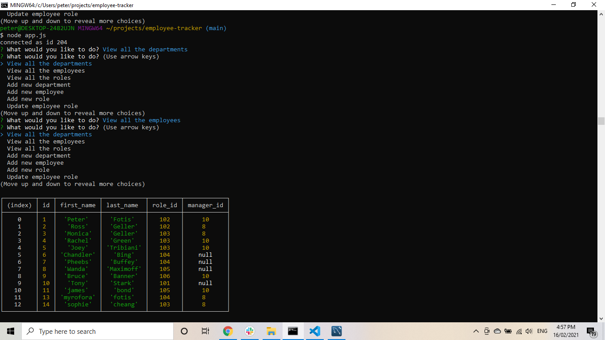
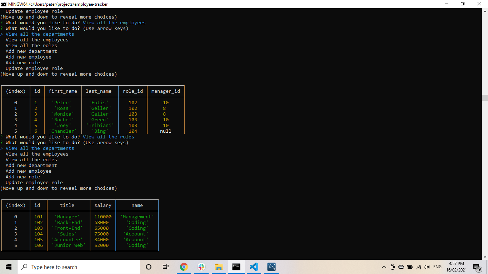
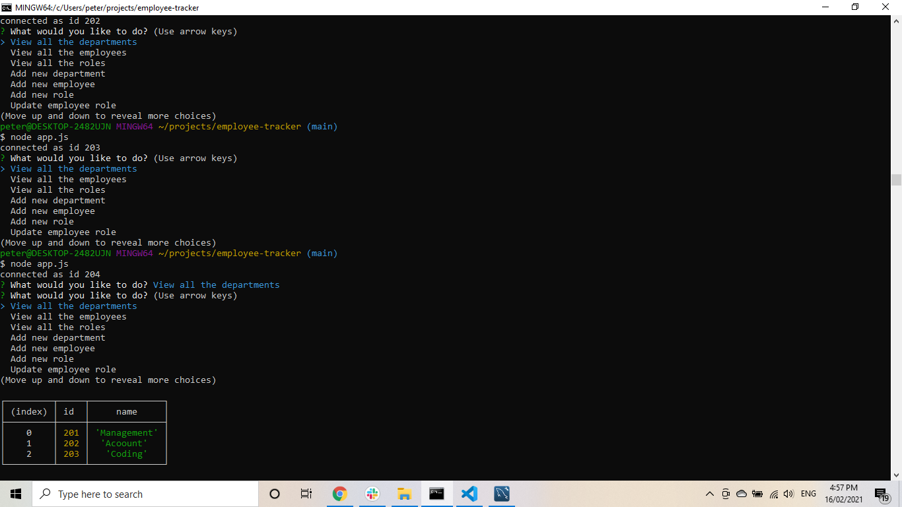
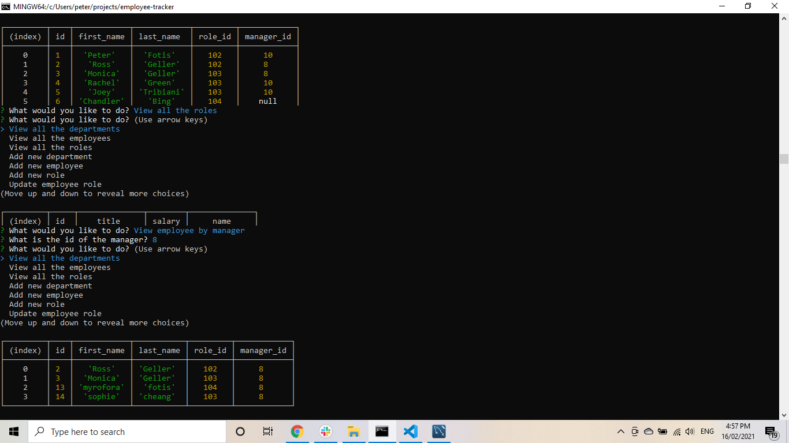

# employee-tracker

[links](#links)
* [Installation](#installation)
  * [ Descriptione](#description)
  * [Tests](#tests)
  * [Questions](#questions)

## links

link of repository :   https://github.com/pfotis/employee-tracker

link of video    :  

## Description

This is a project create a database to help the user to store and search about his/her employee. Addiotional this project work in git bash where the user could use the mysql .

There is  a menu could help the user to choose what he/she wants.

## Installation

npm install inquirer
npm install mysql
npm install console.table

## Test

With the following pictures the user could see the outfit of this project.

## Questions

  Questions about this repository? Please contact me at pfotis@gmail.com.
  View my work in GitHub pfotis(https://github.com/pfotis).